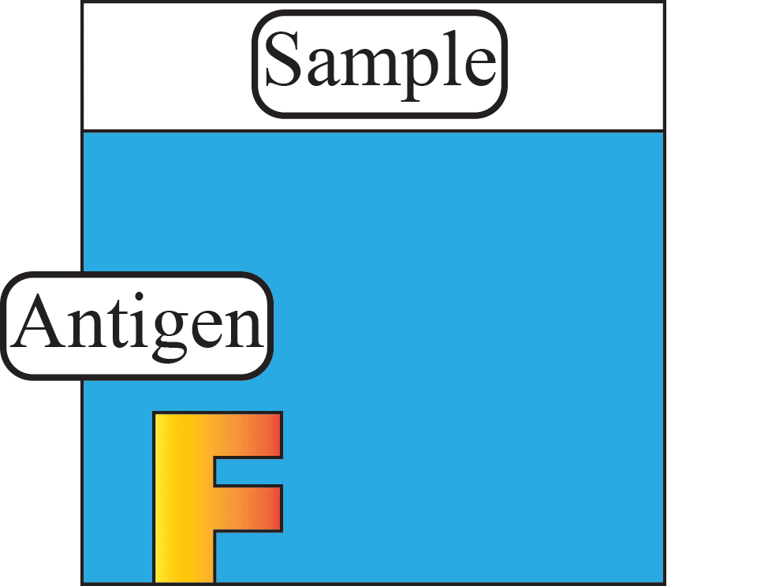
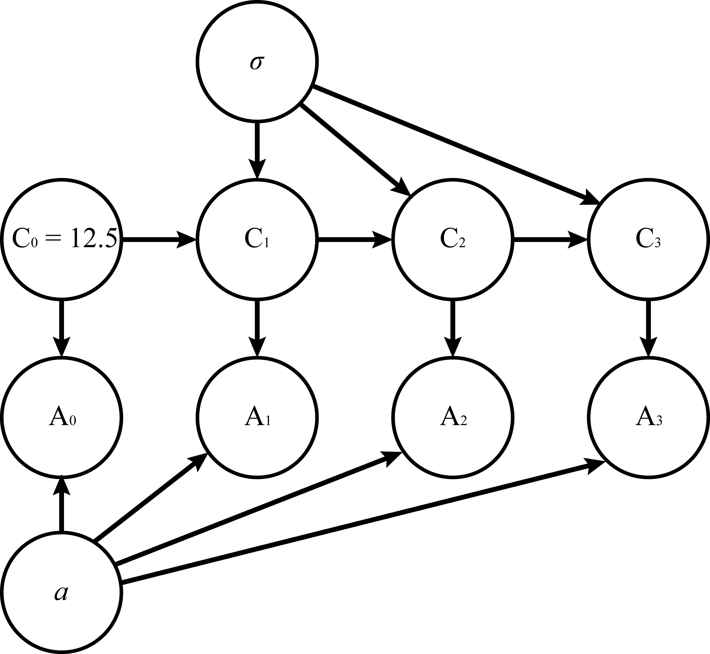

<!DOCTYPE html>
<html>
<head><meta charset="utf-8" />

<body>
  

    

<html>
<h1> The analysis of ELISA serial dilution and optical density measurements</h1>

 <h2>By <i>Huijun Park</i></h2>

<html>
<h3> This code is written using JupyterLab with R kernel</h3>
</html>

<h1 id="Memory-Clearance">Memory Clearance<a class="anchor-link" href="#Memory-Clearance">&#182;</a></h1><h4 id="Make-sure-the-memory-is-clear-at-the-beginning">Make sure the memory is clear at the beginning<a class="anchor-link" href="#Make-sure-the-memory-is-clear-at-the-beginning">&#182;</a></h4>

In&nbsp;[32]:

    

<pre>rm(list=ls()) # All the preloaded variables are removed so that they do not interfere with the code to be followed by
</pre>

    

<h4 id="The-version-of-R-used-for-this-code">The version of R used for this code<a class="anchor-link" href="#The-version-of-R-used-for-this-code">&#182;</a></h4>

In&nbsp;[35]:

    

<pre>version
</pre>

    

    

<pre>               _                           
platform       x86_64-w64-mingw32          
arch           x86_64                      
os             mingw32                     
system         x86_64, mingw32             
status                                     
major          3                           
minor          5.1                         
year           2018                        
month          07                          
day            02                          
svn rev        74947                       
language       R                           
version.string R version 3.5.1 (2018-07-02)
nickname       Feather Spray               </pre>

<h1 id="A-brief-summary-of-theory">A brief summary of theory<a class="anchor-link" href="#A-brief-summary-of-theory">&#182;</a></h1><h3 id="A-dataset-&quot;DNase&quot;-was-elected-to-be-used.-The-dataset-was-chosen-not-only-because-the-underlying-mathematical-model-itself-is-fairly-simple-and-unequivocally-defined-but-the-dilution-process-used-for-data-acquisition-is-widely-used-over-many-scientific-fields-including-biology-and-chemistry,-which-widens-the-applicability-of-the-model.-This-is-a-dataset-that-is-included-with-the-basic-R,-so-it-won't-be-necessary-to-acquire-and-curate-the-data.">A dataset "DNase" was elected to be used. The dataset was chosen not only because the underlying mathematical model itself is fairly simple and unequivocally defined but the dilution process used for data acquisition is widely used over many scientific fields including biology and chemistry, which widens the applicability of the model. This is a dataset that is included with the basic R, so it won't be necessary to acquire and curate the data.<a class="anchor-link" href="#A-dataset-&quot;DNase&quot;-was-elected-to-be-used.-The-dataset-was-chosen-not-only-because-the-underlying-mathematical-model-itself-is-fairly-simple-and-unequivocally-defined-but-the-dilution-process-used-for-data-acquisition-is-widely-used-over-many-scientific-fields-including-biology-and-chemistry,-which-widens-the-applicability-of-the-model.-This-is-a-dataset-that-is-included-with-the-basic-R,-so-it-won't-be-necessary-to-acquire-and-curate-the-data.">&#182;</a></h3><h3 id="ELISA-(Enzyme-Linked-Immunosorbent-Assay)-is-mainly-used-for-qualititive-detection-of-antigens-in-sample.-Respective-antibodies-are-applied-to-the-sample-containing-the-antigens-and-they-act-as-ligaments-to-attach-marker-chemicals-that-are-easier-for-the-observer-to-detect-through-various-means-such-as-color-or-electrical-conductivity.">ELISA (Enzyme-Linked Immunosorbent Assay) is mainly used for qualititive detection of antigens in sample. Respective antibodies are applied to the sample containing the antigens and they act as ligaments to attach marker chemicals that are easier for the observer to detect through various means such as color or electrical conductivity.<a class="anchor-link" href="#ELISA-(Enzyme-Linked-Immunosorbent-Assay)-is-mainly-used-for-qualititive-detection-of-antigens-in-sample.-Respective-antibodies-are-applied-to-the-sample-containing-the-antigens-and-they-act-as-ligaments-to-attach-marker-chemicals-that-are-easier-for-the-observer-to-detect-through-various-means-such-as-color-or-electrical-conductivity.">&#182;</a></h3>

<b><i>Figure 1.<i></b> A marker is applied to make the antigen visible
<h3>In this case the indicator property used is optical density which is usually abbreviated as O.D.. This property measures the opacity of sample by measuring how much of light traveling through the sample reaches the detector.

Additionally, when a need for quantitative analysis is engendered, a serial dilution is performed on the sample.</h3>

<b><i>Figure 2.<i></b> A series of dilution creates an assortment of samples with varying concentration
<h1 id="Load-the-&quot;DNase&quot;-data">Load the "DNase" data<a class="anchor-link" href="#Load-the-&quot;DNase&quot;-data">&#182;</a></h1>

In&nbsp;[3]:

    

<pre>data(&quot;DNase&quot;)
#?DNase # This document includes an RAS syndrome. Can you spot it?
</pre>

    

<h1 id="Data-Exploration">Data Exploration<a class="anchor-link" href="#Data-Exploration">&#182;</a></h1>

In&nbsp;[2]:

    

<pre>head(DNase) # The first n samples
tail(DNase) # The last n samples
</pre>

    

    

<table>
<caption>A nfnGroupedData: 6 × 3</caption>
<thead>
	<tr><th scope=col>Run</th><th scope=col>conc</th><th scope=col>density</th></tr>
	<tr><th scope=col>&lt;ord&gt;</th><th scope=col>&lt;dbl&gt;</th><th scope=col>&lt;dbl&gt;</th></tr>
</thead>
<tbody>
	<tr><td>1</td><td>0.04882812</td><td>0.017</td></tr>
	<tr><td>1</td><td>0.04882812</td><td>0.018</td></tr>
	<tr><td>1</td><td>0.19531250</td><td>0.121</td></tr>
	<tr><td>1</td><td>0.19531250</td><td>0.124</td></tr>
	<tr><td>1</td><td>0.39062500</td><td>0.206</td></tr>
	<tr><td>1</td><td>0.39062500</td><td>0.215</td></tr>
</tbody>
</table>

    

<table>
<caption>A nfnGroupedData: 6 × 3</caption>
<thead>
	<tr><th></th><th scope=col>Run</th><th scope=col>conc</th><th scope=col>density</th></tr>
	<tr><th></th><th scope=col>&lt;ord&gt;</th><th scope=col>&lt;dbl&gt;</th><th scope=col>&lt;dbl&gt;</th></tr>
</thead>
<tbody>
	<tr><th scope=row>171</th><td>11</td><td> 3.125</td><td>0.994</td></tr>
	<tr><th scope=row>172</th><td>11</td><td> 3.125</td><td>0.980</td></tr>
	<tr><th scope=row>173</th><td>11</td><td> 6.250</td><td>1.421</td></tr>
	<tr><th scope=row>174</th><td>11</td><td> 6.250</td><td>1.385</td></tr>
	<tr><th scope=row>175</th><td>11</td><td>12.500</td><td>1.715</td></tr>
	<tr><th scope=row>176</th><td>11</td><td>12.500</td><td>1.721</td></tr>
</tbody>
</table>

In&nbsp;[28]:

    

<pre>pairs(DNase)  # Correlation plot
</pre>

    

    

<h3 id="It-looks-like-there-are-11-&quot;run&quot;s-of-serial-dilution,-ordered-from-1-to-11.-Let-us-check-the-nature-of-the-variables-&quot;conc&quot;-and-&quot;density&quot;.">It looks like there are 11 "run"s of serial dilution, ordered from 1 to 11. Let us check the nature of the variables "conc" and "density".<a class="anchor-link" href="#It-looks-like-there-are-11-&quot;run&quot;s-of-serial-dilution,-ordered-from-1-to-11.-Let-us-check-the-nature-of-the-variables-&quot;conc&quot;-and-&quot;density&quot;.">&#182;</a></h3>

In&nbsp;[11]:

    

<pre>DNase[1:16,]
</pre>

    

    

<table>
<caption>A nfnGroupedData: 16 × 3</caption>
<thead>
	<tr><th scope=col>Run</th><th scope=col>conc</th><th scope=col>density</th></tr>
	<tr><th scope=col>&lt;ord&gt;</th><th scope=col>&lt;dbl&gt;</th><th scope=col>&lt;dbl&gt;</th></tr>
</thead>
<tbody>
	<tr><td>1</td><td> 0.04882812</td><td>0.017</td></tr>
	<tr><td>1</td><td> 0.04882812</td><td>0.018</td></tr>
	<tr><td>1</td><td> 0.19531250</td><td>0.121</td></tr>
	<tr><td>1</td><td> 0.19531250</td><td>0.124</td></tr>
	<tr><td>1</td><td> 0.39062500</td><td>0.206</td></tr>
	<tr><td>1</td><td> 0.39062500</td><td>0.215</td></tr>
	<tr><td>1</td><td> 0.78125000</td><td>0.377</td></tr>
	<tr><td>1</td><td> 0.78125000</td><td>0.374</td></tr>
	<tr><td>1</td><td> 1.56250000</td><td>0.614</td></tr>
	<tr><td>1</td><td> 1.56250000</td><td>0.609</td></tr>
	<tr><td>1</td><td> 3.12500000</td><td>1.019</td></tr>
	<tr><td>1</td><td> 3.12500000</td><td>1.001</td></tr>
	<tr><td>1</td><td> 6.25000000</td><td>1.334</td></tr>
	<tr><td>1</td><td> 6.25000000</td><td>1.364</td></tr>
	<tr><td>1</td><td>12.50000000</td><td>1.730</td></tr>
	<tr><td>1</td><td>12.50000000</td><td>1.710</td></tr>
</tbody>
</table>

<h3 id="There-are-16-data-subsets-per-one-run.-In-reverse-order,-the-concentration-starts-from-12.5-and-exactly-halves-every-two-datasets.-From-this-observation-of-how-they-have-the-exact-numbers,-it-can-be-safely-assumed-that-the-variable-&quot;conc&quot;-is-not-an-observation-of-the-real-concentration-but-rather-an-assumed-parameter-based-on-calculation.-On-the-other-hand,-the-density-variable-should-be-the-value-that-is-acquired-through-experiments-to-predict-the-actual-concentration.-It-is-likely-that-the-observer-measured-the-O.D.-twice-per-a-dilution-of-sample.">There are 16 data subsets per one run. In reverse order, the concentration starts from 12.5 and exactly halves every two datasets. From this observation of how they have the exact numbers, it can be safely assumed that the variable "conc" is not an observation of the real concentration but rather an assumed parameter based on calculation. On the other hand, the density variable should be the value that is acquired through experiments to predict the actual concentration. It is likely that the observer measured the O.D. twice per a dilution of sample.<a class="anchor-link" href="#There-are-16-data-subsets-per-one-run.-In-reverse-order,-the-concentration-starts-from-12.5-and-exactly-halves-every-two-datasets.-From-this-observation-of-how-they-have-the-exact-numbers,-it-can-be-safely-assumed-that-the-variable-&quot;conc&quot;-is-not-an-observation-of-the-real-concentration-but-rather-an-assumed-parameter-based-on-calculation.-On-the-other-hand,-the-density-variable-should-be-the-value-that-is-acquired-through-experiments-to-predict-the-actual-concentration.-It-is-likely-that-the-observer-measured-the-O.D.-twice-per-a-dilution-of-sample.">&#182;</a></h3><h1 id="Optical-density">Optical density<a class="anchor-link" href="#Optical-density">&#182;</a></h1><h3 id="Optical-density-is-defined-as-written-below">Optical density is defined as written below<a class="anchor-link" href="#Optical-density-is-defined-as-written-below">&#182;</a></h3><h3 id="$A-=--\textrm{log}_{10}T$">$A = -\textrm{log}_{10}T$<a class="anchor-link" href="#$A-=--\textrm{log}_{10}T$">&#182;</a></h3><h3 id="Where-A-denotes-the-optical-density-and-T-denotes-the-transmittance-to-be-observed">Where A denotes the optical density and T denotes the transmittance to be observed<a class="anchor-link" href="#Where-A-denotes-the-optical-density-and-T-denotes-the-transmittance-to-be-observed">&#182;</a></h3><h1 id="Beer-Lambert-law">Beer-Lambert law<a class="anchor-link" href="#Beer-Lambert-law">&#182;</a></h1><h3 id="Beer-Lambert-law-states-that,">Beer-Lambert law states that,<a class="anchor-link" href="#Beer-Lambert-law-states-that,">&#182;</a></h3><h3 id="$A-=-\varepsilon\int{c}\,-\mathrm{d}l-$">$A = \varepsilon\int{c}\, \mathrm{d}l $<a class="anchor-link" href="#$A-=-\varepsilon\int{c}\,-\mathrm{d}l-$">&#182;</a></h3><h3 id="$\varepsilon$-is-attenuation-coefficient-unique-to-the-material-and-$c$-is-molar-concentration-which-is-integrated-over-the-optical-path.-If-the-sample-is-homogeneous,-$c$-is-constant-over-the-optical-path-and-the-optical-density-$A$-is-proportional-to-the-conecentration-$c$">$\varepsilon$ is attenuation coefficient unique to the material and $c$ is molar concentration which is integrated over the optical path. If the sample is homogeneous, $c$ is constant over the optical path and the optical density $A$ is proportional to the conecentration $c$<a class="anchor-link" href="#$\varepsilon$-is-attenuation-coefficient-unique-to-the-material-and-$c$-is-molar-concentration-which-is-integrated-over-the-optical-path.-If-the-sample-is-homogeneous,-$c$-is-constant-over-the-optical-path-and-the-optical-density-$A$-is-proportional-to-the-conecentration-$c$">&#182;</a></h3>

In&nbsp;[25]:

    

<pre># Density ~ conc plot for each runs of serial dilution
coplot(density ~ conc | Run, data = DNase,
       show.given = FALSE, type = &quot;b&quot;)
coplot(density ~ log(conc) | Run, data = DNase,
       show.given = FALSE, type = &quot;b&quot;)
</pre>

    

    

    

<h3 id="Optical-density-seems-to-lose-its-linearity-at-higher-concentration.-This-is-possibly-not-measured-with-laser-based-instruments-and-the-interaction-from-other-wavelength-is-spilling-over-at-high-concentration-samples.-Also,-the-sample-becomes-diffuse-and-multiple-scattering-affects-the-photodiode.-Regardless-of-the-reason,-it-is-generally-recommended-to-measure-the-O.D.-only-between-0.2-and-0.8-because-of-this-nonlinearity-problem.-However,-we-can-still-try-to-fit-a-curve-to-the-observed-data.-The-O.D.-seems-to-follow-the-logarithmic-curve-at-higher-concentration.-We-will-dissect-this-curve-into-two-parts.">Optical density seems to lose its linearity at higher concentration. This is possibly not measured with laser based instruments and the interaction from other wavelength is spilling over at high concentration samples. Also, the sample becomes diffuse and multiple scattering affects the photodiode. Regardless of the reason, it is generally recommended to measure the O.D. only between 0.2 and 0.8 because of this nonlinearity problem. However, we can still try to fit a curve to the observed data. The O.D. seems to follow the logarithmic curve at higher concentration. We will dissect this curve into two parts.<a class="anchor-link" href="#Optical-density-seems-to-lose-its-linearity-at-higher-concentration.-This-is-possibly-not-measured-with-laser-based-instruments-and-the-interaction-from-other-wavelength-is-spilling-over-at-high-concentration-samples.-Also,-the-sample-becomes-diffuse-and-multiple-scattering-affects-the-photodiode.-Regardless-of-the-reason,-it-is-generally-recommended-to-measure-the-O.D.-only-between-0.2-and-0.8-because-of-this-nonlinearity-problem.-However,-we-can-still-try-to-fit-a-curve-to-the-observed-data.-The-O.D.-seems-to-follow-the-logarithmic-curve-at-higher-concentration.-We-will-dissect-this-curve-into-two-parts.">&#182;</a></h3><h1 id="Linear-curve">Linear curve<a class="anchor-link" href="#Linear-curve">&#182;</a></h1><h3 id="The-O.D.-for-the-lower-concentration-regime-which-follows-Beer-Lambert-law-should-be-linear.">The O.D. for the lower concentration regime which follows Beer-Lambert law should be linear.<a class="anchor-link" href="#The-O.D.-for-the-lower-concentration-regime-which-follows-Beer-Lambert-law-should-be-linear.">&#182;</a></h3><h3 id="The-O.D.-for-the-higher-concentration-will-be-fit-to-a-sigmoid-curve-since-the-O.D.-should-always-be-positive.">The O.D. for the higher concentration will be fit to a sigmoid curve since the O.D. should always be positive.<a class="anchor-link" href="#The-O.D.-for-the-higher-concentration-will-be-fit-to-a-sigmoid-curve-since-the-O.D.-should-always-be-positive.">&#182;</a></h3>

<h2>$A= 
\begin{cases}
    a_1c,&amp; \text{for small }c\\
    \frac{a_4}{1+e^{-(a_2c+a_3)}}+a_5,              &amp; \text{for large }c
\end{cases}$</h2>
<h3 id="Give-weights-to-each-models-to-combine-them-into-one-equation.-We-will-use-a-reversed-sigmoid-weight-here.">Give weights to each models to combine them into one equation. We will use a reversed sigmoid weight here.<a class="anchor-link" href="#Give-weights-to-each-models-to-combine-them-into-one-equation.-We-will-use-a-reversed-sigmoid-weight-here.">&#182;</a></h3><h2 id="$w=\frac{1}{1+e^{a_6c+a_7}}$">$w=\frac{1}{1+e^{a_6c+a_7}}$<a class="anchor-link" href="#$w=\frac{1}{1+e^{a_6c+a_7}}$">&#182;</a></h2><h3 id="$A=-wa_1c-+(1-w)(\frac{a_4}{1+e^{-(a_2c+a_3)}}+a_5)$">$A= wa_1c +(1-w)(\frac{a_4}{1+e^{-(a_2c+a_3)}}+a_5)$<a class="anchor-link" href="#$A=-wa_1c-+(1-w)(\frac{a_4}{1+e^{-(a_2c+a_3)}}+a_5)$">&#182;</a></h3><h1 id="Serial-dilution">Serial dilution<a class="anchor-link" href="#Serial-dilution">&#182;</a></h1><h3 id="An-each-step-of-dilution-can-be-thought-of-as-a-combination-of-Bernoulli-trials-of-$p=\frac{1}{2}$-for-all-of-the-antigen-particles-in-the-sample.-With-the-number-of-starting-antigen-$n$,-it-follows-the-binomial-distribution-with-mean-and-variance-of-$np=\frac{n}{2},$-$np(1-p)=\frac{n}{4}$-respectively.-The-standard-deviation-is-$\frac{\sqrt{n}}{2}$-in-this-case.-Let's-not-forget-there-is-human-error-from-dilution-process-so-$p$-itself-has-deviation.-Since-$n$-is-a-large-number-of-particles-the-standard-deviation-compared-to-the-mean-is-relatively-small-($O(\frac{1}{\sqrt{n}})$).-So-the-human-dilution-error-should-be-the-dominant-factor-here-and-we-will-simplify-the-dilution-process-into-the-normal-distribution-$N(\frac{\sqrt{n}}{2},n\sigma^2)$.-The-real-concentration-of-a-sample-is-correlated-to-the-concentration-of-prior-dilutions">An each step of dilution can be thought of as a combination of Bernoulli trials of $p=\frac{1}{2}$ for all of the antigen particles in the sample. With the number of starting antigen $n$, it follows the binomial distribution with mean and variance of $np=\frac{n}{2},$ $np(1-p)=\frac{n}{4}$ respectively. The standard deviation is $\frac{\sqrt{n}}{2}$ in this case. Let's not forget there is human error from dilution process so $p$ itself has deviation. Since $n$ is a large number of particles the standard deviation compared to the mean is relatively small ($O(\frac{1}{\sqrt{n}})$). So the human dilution error should be the dominant factor here and we will simplify the dilution process into the normal distribution $N(\frac{\sqrt{n}}{2},n\sigma^2)$. The real concentration of a sample is correlated to the concentration of prior dilutions<a class="anchor-link" href="#An-each-step-of-dilution-can-be-thought-of-as-a-combination-of-Bernoulli-trials-of-$p=\frac{1}{2}$-for-all-of-the-antigen-particles-in-the-sample.-With-the-number-of-starting-antigen-$n$,-it-follows-the-binomial-distribution-with-mean-and-variance-of-$np=\frac{n}{2},$-$np(1-p)=\frac{n}{4}$-respectively.-The-standard-deviation-is-$\frac{\sqrt{n}}{2}$-in-this-case.-Let's-not-forget-there-is-human-error-from-dilution-process-so-$p$-itself-has-deviation.-Since-$n$-is-a-large-number-of-particles-the-standard-deviation-compared-to-the-mean-is-relatively-small-($O(\frac{1}{\sqrt{n}})$).-So-the-human-dilution-error-should-be-the-dominant-factor-here-and-we-will-simplify-the-dilution-process-into-the-normal-distribution-$N(\frac{\sqrt{n}}{2},n\sigma^2)$.-The-real-concentration-of-a-sample-is-correlated-to-the-concentration-of-prior-dilutions">&#182;</a></h3>

<b><i>Figure 3.<i></b> Graphical model of a serial dilution process. $C$ here denotes the actual concentration, not the assumed concentration
<h3 id="This-hierarchical-model-should-be-established-for-each-run.">This hierarchical model should be established for each run.<a class="anchor-link" href="#This-hierarchical-model-should-be-established-for-each-run.">&#182;</a></h3><h3 id="Side-note:-Notice-how-this-model-would-fit-nicely-for-an-RNN(Recurrent-Neural-Network)-for-the-deterministic-analysis.-As-we-are-concerned-with-the-stochastic-nature-of-the-problem-we-are-dealing-with,-we-opt-to-do-the-analysis-that-is-based-on-Bayesian-statistics.">Side note: Notice how this model would fit nicely for an RNN(Recurrent Neural Network) for the deterministic analysis. As we are concerned with the stochastic nature of the problem we are dealing with, we opt to do the analysis that is based on Bayesian statistics.<a class="anchor-link" href="#Side-note:-Notice-how-this-model-would-fit-nicely-for-an-RNN(Recurrent-Neural-Network)-for-the-deterministic-analysis.-As-we-are-concerned-with-the-stochastic-nature-of-the-problem-we-are-dealing-with,-we-opt-to-do-the-analysis-that-is-based-on-Bayesian-statistics.">&#182;</a></h3><h1 id="Sensor-noise">Sensor noise<a class="anchor-link" href="#Sensor-noise">&#182;</a></h1><h3 id="The-O.D.-measurement-itself-is-also-bound-to-include-noise.-First,-photodiodes-have-their-inherent-dark-current-noises-and-digitization-noise.-Also-the-process-of-creation-and-observation-of-photons-also-follows-Bernoulli-process-which-culminates-into-binomial-distribution-which-in-a-long-measurement-span-and-low-chance-approximates-to-Poisson-distribution-which-creates-shot-noise.-We-will-disregard-these-factors-here-lest-we-should-make-the-analysis-too-involved.">The O.D. measurement itself is also bound to include noise. First, photodiodes have their inherent dark current noises and digitization noise. Also the process of creation and observation of photons also follows Bernoulli process which culminates into binomial distribution which in a long measurement span and low chance approximates to Poisson distribution which creates shot noise. We will disregard these factors here lest we should make the analysis too involved.<a class="anchor-link" href="#The-O.D.-measurement-itself-is-also-bound-to-include-noise.-First,-photodiodes-have-their-inherent-dark-current-noises-and-digitization-noise.-Also-the-process-of-creation-and-observation-of-photons-also-follows-Bernoulli-process-which-culminates-into-binomial-distribution-which-in-a-long-measurement-span-and-low-chance-approximates-to-Poisson-distribution-which-creates-shot-noise.-We-will-disregard-these-factors-here-lest-we-should-make-the-analysis-too-involved.">&#182;</a></h3>

<h1 id="R-JAGS">R-JAGS<a class="anchor-link" href="#R-JAGS">&#182;</a></h1><h3 id="We-are-going-to-use-R-JAGS(Just-Another-Gibbs-Sampler)-to-create-a-model-for-the-Gibbs-sampler-and-create-a-Markov-chain-to-conduct-an-MCMC(Markov-Chan-Monte-Carlo)-simulation.">We are going to use R-JAGS(Just Another Gibbs Sampler) to create a model for the Gibbs sampler and create a Markov chain to conduct an MCMC(Markov Chan Monte Carlo) simulation.<a class="anchor-link" href="#We-are-going-to-use-R-JAGS(Just-Another-Gibbs-Sampler)-to-create-a-model-for-the-Gibbs-sampler-and-create-a-Markov-chain-to-conduct-an-MCMC(Markov-Chan-Monte-Carlo)-simulation.">&#182;</a></h3>

In&nbsp;[73]:

    

<pre>DNase$Run=as.numeric(as.character(DNase$Run)) # Make sure run is numeric
</pre>

    

In&nbsp;[74]:

    

<pre>max(DNase$Run) # Check that there are 11 runs
</pre>

    

    

11

In&nbsp;[18]:

    

<pre>any(is.na(DNase)) # Check if there is a missing data
</pre>

    

    

FALSE

In&nbsp;[21]:

    

<pre>library(&quot;rjags&quot;) # Load rjags library
</pre>

    

<h3 id="Given-that-there-are-many-hidden-variables-and-not-so-many-observation-data-points,-there-bound-to-be-some-predicament-with-the-curse-of-dimensionality.-With-that-in-mind,-the-priors-were-given-in-a-quite-heavy-handed-way.-Refer-to-the-supplementary-material-which-shows-how-the-priors-were-determined.">Given that there are many hidden variables and not so many observation data points, there bound to be some predicament with the curse of dimensionality. With that in mind, the priors were given in a quite heavy handed way. Refer to the supplementary material which shows how the priors were determined.<a class="anchor-link" href="#Given-that-there-are-many-hidden-variables-and-not-so-many-observation-data-points,-there-bound-to-be-some-predicament-with-the-curse-of-dimensionality.-With-that-in-mind,-the-priors-were-given-in-a-quite-heavy-handed-way.-Refer-to-the-supplementary-material-which-shows-how-the-priors-were-determined.">&#182;</a></h3>

In&nbsp;[403]:

    

<pre># set the model as a string
mod_string = &quot; model{
    for (i in 1:11){
        realconc[1,i]~dnorm(25,prec/2*25.0)
        for (j in 2:7){
            realconc[j,i] ~ dnorm(realconc[j-1,i]/2,prec/(2*realconc[j-1,i]))    
        }
        for (j in c(8)){
            realconc[j,i] ~ dnorm(realconc[j-1,i]/4,prec/(1.0*realconc[j-1,i]))      
        }
        density[i*16] ~ dnorm(realconc[1,i]*a[1]/(1.0+exp(realconc[1,i]*a[6]+a[7]))+(1-1/(1.0+exp(realconc[1,i]*a[6]+a[7])))*(a[4]/(1+exp(-a[2]*realconc[1,i]-a[3]))+a[5]),prec_obs)
        density[i*16-1] ~ dnorm(realconc[1,i]*a[1]/(1.0+exp(realconc[1,i]*a[6]+a[7]))+(1-1/(1.0+exp(realconc[1,i]*a[6]+a[7])))*(a[4]/(1+exp(-a[2]*realconc[1,i]-a[3]))+a[5]),prec_obs)
        density[i*16-2] ~ dnorm(realconc[2,i]*a[1]/(1.0+exp(realconc[2,i]*a[6]+a[7]))+(1-1/(1.0+exp(realconc[2,i]*a[6]+a[7])))*(a[4]/(1+exp(-a[2]*realconc[2,i]-a[3]))+a[5]),prec_obs)
        density[i*16-3] ~ dnorm(realconc[2,i]*a[1]/(1.0+exp(realconc[2,i]*a[6]+a[7]))+(1-1/(1.0+exp(realconc[2,i]*a[6]+a[7])))*(a[4]/(1+exp(-a[2]*realconc[2,i]-a[3]))+a[5]),prec_obs)
        density[i*16-4] ~ dnorm(realconc[3,i]*a[1]/(1.0+exp(realconc[3,i]*a[6]+a[7]))+(1-1/(1.0+exp(realconc[3,i]*a[6]+a[7])))*(a[4]/(1+exp(-a[2]*realconc[3,i]-a[3]))+a[5]),prec_obs)
        density[i*16-5] ~ dnorm(realconc[3,i]*a[1]/(1.0+exp(realconc[3,i]*a[6]+a[7]))+(1-1/(1.0+exp(realconc[3,i]*a[6]+a[7])))*(a[4]/(1+exp(-a[2]*realconc[3,i]-a[3]))+a[5]),prec_obs)
        density[i*16-6] ~ dnorm(realconc[4,i]*a[1]/(1.0+exp(realconc[4,i]*a[6]+a[7]))+(1-1/(1.0+exp(realconc[4,i]*a[6]+a[7])))*(a[4]/(1+exp(-a[2]*realconc[4,i]-a[3]))+a[5]),prec_obs)
        density[i*16-7] ~ dnorm(realconc[4,i]*a[1]/(1.0+exp(realconc[4,i]*a[6]+a[7]))+(1-1/(1.0+exp(realconc[4,i]*a[6]+a[7])))*(a[4]/(1+exp(-a[2]*realconc[4,i]-a[3]))+a[5]),prec_obs)
        density[i*16-8] ~ dnorm(realconc[5,i]*a[1]/(1.0+exp(realconc[5,i]*a[6]+a[7]))+(1-1/(1.0+exp(realconc[5,i]*a[6]+a[7])))*(a[4]/(1+exp(-a[2]*realconc[5,i]-a[3]))+a[5]),prec_obs)
        density[i*16-9] ~ dnorm(realconc[5,i]*a[1]/(1.0+exp(realconc[5,i]*a[6]+a[7]))+(1-1/(1.0+exp(realconc[5,i]*a[6]+a[7])))*(a[4]/(1+exp(-a[2]*realconc[5,i]-a[3]))+a[5]),prec_obs)
        density[i*16-10] ~ dnorm(realconc[6,i]*a[1]/(1.0+exp(realconc[6,i]*a[6]+a[7]))+(1-1/(1.0+exp(realconc[6,i]*a[6]+a[7])))*(a[4]/(1+exp(-a[2]*realconc[6,i]-a[3]))+a[5]),prec_obs)
        density[i*16-11] ~ dnorm(realconc[6,i]*a[1]/(1.0+exp(realconc[6,i]*a[6]+a[7]))+(1-1/(1.0+exp(realconc[6,i]*a[6]+a[7])))*(a[4]/(1+exp(-a[2]*realconc[6,i]-a[3]))+a[5]),prec_obs)
        density[i*16-12] ~ dnorm(realconc[7,i]*a[1]/(1.0+exp(realconc[7,i]*a[6]+a[7]))+(1-1/(1.0+exp(realconc[7,i]*a[6]+a[7])))*(a[4]/(1+exp(-a[2]*realconc[7,i]-a[3]))+a[5]),prec_obs)
        density[i*16-13] ~ dnorm(realconc[7,i]*a[1]/(1.0+exp(realconc[7,i]*a[6]+a[7]))+(1-1/(1.0+exp(realconc[7,i]*a[6]+a[7])))*(a[4]/(1+exp(-a[2]*realconc[7,i]-a[3]))+a[5]),prec_obs)
        density[i*16-14] ~ dnorm(realconc[8,i]*a[1]/(1.0+exp(realconc[8,i]*a[6]+a[7]))+(1-1/(1.0+exp(realconc[8,i]*a[6]+a[7])))*(a[4]/(1+exp(-a[2]*realconc[8,i]-a[3]))+a[5]),prec_obs)
        density[i*16-15] ~ dnorm(realconc[8,i]*a[1]/(1.0+exp(realconc[8,i]*a[6]+a[7]))+(1-1/(1.0+exp(realconc[8,i]*a[6]+a[7])))*(a[4]/(1+exp(-a[2]*realconc[8,i]-a[3]))+a[5]),prec_obs)
    }
    prec ~ dgamma(1.0e-4, 1.0e-4/1.0e2)
    prec_obs ~ dgamma(1.0e-4, 1.0e-4/1.0e2)
    sig = 1/prec
    sig_obs = 1/prec_obs
    a[1] ~dnorm(0.4, 1.0/1e-1)
    a[2] ~dnorm(0.3, 1.0/1e-1)
    a[3] ~dnorm(-0.6, 1.0/1e-1)
    a[4] ~dnorm(2, 1.0/1e-1)
    a[5] ~dnorm(-0.2, 1.0/1e-1)
    a[6] ~dnorm(1, 1.0/1e-1)
    a[7] ~dnorm(-2, 1.0/1e-1)
}
&quot;
</pre>

    

In&nbsp;[404]:

    

<pre>set.seed(101) # Set the seed
</pre>

    

In&nbsp;[405]:

    

<pre>data_jags = as.list(DNase) # Set the data
</pre>

    

In&nbsp;[406]:

    

<pre>mod = jags.model(textConnection(mod_string), data=data_jags, n.chains=3) # Initialize the model
</pre>

    

    

<pre>Warning message in jags.model(textConnection(mod_string), data = data_jags, n.chains = 3):
&#34;Unused variable &#34;Run&#34; in data&#34;Warning message in jags.model(textConnection(mod_string), data = data_jags, n.chains = 3):
&#34;Unused variable &#34;conc&#34; in data&#34;</pre>

    

<pre>Compiling model graph
   Resolving undeclared variables
   Allocating nodes
Graph information:
   Observed stochastic nodes: 176
   Unobserved stochastic nodes: 97
   Total graph size: 1933

Initializing model

</pre>

In&nbsp;[407]:

    

<pre>update(mod, 1e3) # Run the burn in period for 1000 iterations
</pre>

    

In&nbsp;[408]:

    

<pre>params = c(&quot;realconc&quot;, &quot;sig&quot;,&quot;sig_obs&quot;,&quot;a&quot;) # Set the parameters to analyse
</pre>

    

In&nbsp;[409]:

    

<pre># Run and save the Markov chain for 5000 iterations
mod_sim = coda.samples(model=mod,
                        variable.names=params,
                        n.iter=5e3)
mod_csim = as.mcmc(do.call(rbind, mod_sim))
</pre>

    

In&nbsp;[410]:

    

<pre>plot(mod_sim) # Plot the Markov chain
</pre>

    

    

    

    

    

<h3 id="The-estimated-posterior-of-real-concentration-seems-to-have-quite-big-deviation.-Since-there-seems-to-be-an-insufficiency-of-the-observations-to-affect-the-posterior-deeply-enough,-we-will-try-to-change-the-sigma-value-and-see-how-it-goes.">The estimated posterior of real concentration seems to have quite big deviation. Since there seems to be an insufficiency of the observations to affect the posterior deeply enough, we will try to change the sigma value and see how it goes.<a class="anchor-link" href="#The-estimated-posterior-of-real-concentration-seems-to-have-quite-big-deviation.-Since-there-seems-to-be-an-insufficiency-of-the-observations-to-affect-the-posterior-deeply-enough,-we-will-try-to-change-the-sigma-value-and-see-how-it-goes.">&#182;</a></h3>

In&nbsp;[411]:

    

<pre># reset the model as a string
mod_string = &quot; model{
    for (i in 1:11){
        realconc[1,i]~dnorm(25,prec/2*25.0)
        for (j in 2:7){
            realconc[j,i] ~ dnorm(realconc[j-1,i]/2,prec/(2*realconc[j-1,i]))    
        }
        for (j in c(8)){
            realconc[j,i] ~ dnorm(realconc[j-1,i]/4,prec/(1.0*realconc[j-1,i]))      
        }
        density[i*16] ~ dnorm(realconc[1,i]*a[1]/(1.0+exp(realconc[1,i]*a[6]+a[7]))+(1-1/(1.0+exp(realconc[1,i]*a[6]+a[7])))*(a[4]/(1+exp(-a[2]*realconc[1,i]-a[3]))+a[5]),prec_obs)
        density[i*16-1] ~ dnorm(realconc[1,i]*a[1]/(1.0+exp(realconc[1,i]*a[6]+a[7]))+(1-1/(1.0+exp(realconc[1,i]*a[6]+a[7])))*(a[4]/(1+exp(-a[2]*realconc[1,i]-a[3]))+a[5]),prec_obs)
        density[i*16-2] ~ dnorm(realconc[2,i]*a[1]/(1.0+exp(realconc[2,i]*a[6]+a[7]))+(1-1/(1.0+exp(realconc[2,i]*a[6]+a[7])))*(a[4]/(1+exp(-a[2]*realconc[2,i]-a[3]))+a[5]),prec_obs)
        density[i*16-3] ~ dnorm(realconc[2,i]*a[1]/(1.0+exp(realconc[2,i]*a[6]+a[7]))+(1-1/(1.0+exp(realconc[2,i]*a[6]+a[7])))*(a[4]/(1+exp(-a[2]*realconc[2,i]-a[3]))+a[5]),prec_obs)
        density[i*16-4] ~ dnorm(realconc[3,i]*a[1]/(1.0+exp(realconc[3,i]*a[6]+a[7]))+(1-1/(1.0+exp(realconc[3,i]*a[6]+a[7])))*(a[4]/(1+exp(-a[2]*realconc[3,i]-a[3]))+a[5]),prec_obs)
        density[i*16-5] ~ dnorm(realconc[3,i]*a[1]/(1.0+exp(realconc[3,i]*a[6]+a[7]))+(1-1/(1.0+exp(realconc[3,i]*a[6]+a[7])))*(a[4]/(1+exp(-a[2]*realconc[3,i]-a[3]))+a[5]),prec_obs)
        density[i*16-6] ~ dnorm(realconc[4,i]*a[1]/(1.0+exp(realconc[4,i]*a[6]+a[7]))+(1-1/(1.0+exp(realconc[4,i]*a[6]+a[7])))*(a[4]/(1+exp(-a[2]*realconc[4,i]-a[3]))+a[5]),prec_obs)
        density[i*16-7] ~ dnorm(realconc[4,i]*a[1]/(1.0+exp(realconc[4,i]*a[6]+a[7]))+(1-1/(1.0+exp(realconc[4,i]*a[6]+a[7])))*(a[4]/(1+exp(-a[2]*realconc[4,i]-a[3]))+a[5]),prec_obs)
        density[i*16-8] ~ dnorm(realconc[5,i]*a[1]/(1.0+exp(realconc[5,i]*a[6]+a[7]))+(1-1/(1.0+exp(realconc[5,i]*a[6]+a[7])))*(a[4]/(1+exp(-a[2]*realconc[5,i]-a[3]))+a[5]),prec_obs)
        density[i*16-9] ~ dnorm(realconc[5,i]*a[1]/(1.0+exp(realconc[5,i]*a[6]+a[7]))+(1-1/(1.0+exp(realconc[5,i]*a[6]+a[7])))*(a[4]/(1+exp(-a[2]*realconc[5,i]-a[3]))+a[5]),prec_obs)
        density[i*16-10] ~ dnorm(realconc[6,i]*a[1]/(1.0+exp(realconc[6,i]*a[6]+a[7]))+(1-1/(1.0+exp(realconc[6,i]*a[6]+a[7])))*(a[4]/(1+exp(-a[2]*realconc[6,i]-a[3]))+a[5]),prec_obs)
        density[i*16-11] ~ dnorm(realconc[6,i]*a[1]/(1.0+exp(realconc[6,i]*a[6]+a[7]))+(1-1/(1.0+exp(realconc[6,i]*a[6]+a[7])))*(a[4]/(1+exp(-a[2]*realconc[6,i]-a[3]))+a[5]),prec_obs)
        density[i*16-12] ~ dnorm(realconc[7,i]*a[1]/(1.0+exp(realconc[7,i]*a[6]+a[7]))+(1-1/(1.0+exp(realconc[7,i]*a[6]+a[7])))*(a[4]/(1+exp(-a[2]*realconc[7,i]-a[3]))+a[5]),prec_obs)
        density[i*16-13] ~ dnorm(realconc[7,i]*a[1]/(1.0+exp(realconc[7,i]*a[6]+a[7]))+(1-1/(1.0+exp(realconc[7,i]*a[6]+a[7])))*(a[4]/(1+exp(-a[2]*realconc[7,i]-a[3]))+a[5]),prec_obs)
        density[i*16-14] ~ dnorm(realconc[8,i]*a[1]/(1.0+exp(realconc[8,i]*a[6]+a[7]))+(1-1/(1.0+exp(realconc[8,i]*a[6]+a[7])))*(a[4]/(1+exp(-a[2]*realconc[8,i]-a[3]))+a[5]),prec_obs)
        density[i*16-15] ~ dnorm(realconc[8,i]*a[1]/(1.0+exp(realconc[8,i]*a[6]+a[7]))+(1-1/(1.0+exp(realconc[8,i]*a[6]+a[7])))*(a[4]/(1+exp(-a[2]*realconc[8,i]-a[3]))+a[5]),prec_obs)
    }
    prec ~ dgamma(1.0e-4, 1.0e-4/1.0e4)
    prec_obs ~ dgamma(1.0e-4, 1.0e-4/1.0e4)
    sig = 1/prec
    sig_obs = 1/prec_obs
    a[1] ~dnorm(0.4, 1.0/1e-1)
    a[2] ~dnorm(0.3, 1.0/1e-1)
    a[3] ~dnorm(-0.6, 1.0/1e-1)
    a[4] ~dnorm(2, 1.0/1e-1)
    a[5] ~dnorm(-0.2, 1.0/1e-1)
    a[6] ~dnorm(1, 1.0/1e-1)
    a[7] ~dnorm(-2, 1.0/1e-1)
}
&quot;
</pre>

    

In&nbsp;[412]:

    

<pre>mod = jags.model(textConnection(mod_string), data=data_jags, n.chains=3) # Reinitialize the model
</pre>

    

    

<pre>Warning message in jags.model(textConnection(mod_string), data = data_jags, n.chains = 3):
&#34;Unused variable &#34;Run&#34; in data&#34;Warning message in jags.model(textConnection(mod_string), data = data_jags, n.chains = 3):
&#34;Unused variable &#34;conc&#34; in data&#34;</pre>

    

<pre>Compiling model graph
   Resolving undeclared variables
   Allocating nodes
Graph information:
   Observed stochastic nodes: 176
   Unobserved stochastic nodes: 97
   Total graph size: 1933

Initializing model

</pre>

In&nbsp;[413]:

    

<pre>update(mod, 1e3) # Run the burn in period for 1000 iterations
</pre>

    

In&nbsp;[414]:

    

<pre># Run and save the Markov chain for 5000 iterations
mod_sim = coda.samples(model=mod,
                        variable.names=params,
                        n.iter=5e3)
mod_csim = as.mcmc(do.call(rbind, mod_sim))
</pre>

    

In&nbsp;[415]:

    

<pre>plot(mod_sim) # Plot the Markov chain
</pre>

    

    

    

    

    

<h3 id="It-seems-like-it-didn't-have-much-of-a-serious-effect.-However-the-parameter-'a'-is-moving-a-bit.">It seems like it didn't have much of a serious effect. However the parameter 'a' is moving a bit.<a class="anchor-link" href="#It-seems-like-it-didn't-have-much-of-a-serious-effect.-However-the-parameter-'a'-is-moving-a-bit.">&#182;</a></h3>

<h1 id="Gelman-diagnosis">Gelman diagnosis<a class="anchor-link" href="#Gelman-diagnosis">&#182;</a></h1><h3 id="Many-of-parameters-a-are-not-really-close-to-1">Many of parameters a are not really close to 1<a class="anchor-link" href="#Many-of-parameters-a-are-not-really-close-to-1">&#182;</a></h3>

In&nbsp;[416]:

    

<pre>gelman.diag(mod_sim)
</pre>

    

    

<pre>Potential scale reduction factors:

               Point est. Upper C.I.
a[1]                 1.02       1.05
a[2]                 1.14       1.42
a[3]                 1.31       1.95
a[4]                 1.20       1.64
a[5]                 1.19       1.62
a[6]                 1.04       1.11
a[7]                 1.02       1.03
realconc[1,1]        1.00       1.00
realconc[2,1]        1.00       1.00
realconc[3,1]        1.00       1.00
realconc[4,1]        1.00       1.01
realconc[5,1]        1.00       1.01
realconc[6,1]        1.00       1.01
realconc[7,1]        1.00       1.01
realconc[8,1]        1.00       1.01
realconc[1,2]        1.00       1.00
realconc[2,2]        1.00       1.00
realconc[3,2]        1.00       1.00
realconc[4,2]        1.00       1.00
realconc[5,2]        1.00       1.00
realconc[6,2]        1.00       1.00
realconc[7,2]        1.00       1.00
realconc[8,2]        1.00       1.00
realconc[1,3]        1.00       1.00
realconc[2,3]        1.00       1.00
realconc[3,3]        1.00       1.00
realconc[4,3]        1.00       1.00
realconc[5,3]        1.00       1.00
realconc[6,3]        1.00       1.00
realconc[7,3]        1.00       1.00
realconc[8,3]        1.00       1.00
realconc[1,4]        1.00       1.00
realconc[2,4]        1.00       1.00
realconc[3,4]        1.00       1.00
realconc[4,4]        1.00       1.00
realconc[5,4]        1.00       1.00
realconc[6,4]        1.00       1.00
realconc[7,4]        1.00       1.00
realconc[8,4]        1.00       1.00
realconc[1,5]        1.00       1.00
realconc[2,5]        1.00       1.00
realconc[3,5]        1.00       1.00
realconc[4,5]        1.00       1.01
realconc[5,5]        1.00       1.01
realconc[6,5]        1.00       1.01
realconc[7,5]        1.00       1.01
realconc[8,5]        1.00       1.00
realconc[1,6]        1.00       1.00
realconc[2,6]        1.00       1.00
realconc[3,6]        1.00       1.00
realconc[4,6]        1.00       1.00
realconc[5,6]        1.00       1.00
realconc[6,6]        1.00       1.00
realconc[7,6]        1.00       1.00
realconc[8,6]        1.00       1.00
realconc[1,7]        1.00       1.00
realconc[2,7]        1.00       1.00
realconc[3,7]        1.00       1.00
realconc[4,7]        1.00       1.00
realconc[5,7]        1.00       1.00
realconc[6,7]        1.00       1.00
realconc[7,7]        1.00       1.00
realconc[8,7]        1.00       1.00
realconc[1,8]        1.00       1.00
realconc[2,8]        1.00       1.00
realconc[3,8]        1.00       1.00
realconc[4,8]        1.00       1.00
realconc[5,8]        1.00       1.00
realconc[6,8]        1.00       1.00
realconc[7,8]        1.00       1.00
realconc[8,8]        1.00       1.00
realconc[1,9]        1.00       1.00
realconc[2,9]        1.00       1.00
realconc[3,9]        1.00       1.00
realconc[4,9]        1.00       1.00
realconc[5,9]        1.00       1.00
realconc[6,9]        1.00       1.00
realconc[7,9]        1.00       1.00
realconc[8,9]        1.00       1.00
realconc[1,10]       1.00       1.00
realconc[2,10]       1.00       1.00
realconc[3,10]       1.00       1.00
realconc[4,10]       1.00       1.00
realconc[5,10]       1.00       1.00
realconc[6,10]       1.00       1.01
realconc[7,10]       1.00       1.01
realconc[8,10]       1.00       1.00
realconc[1,11]       1.00       1.00
realconc[2,11]       1.00       1.00
realconc[3,11]       1.00       1.01
realconc[4,11]       1.00       1.01
realconc[5,11]       1.00       1.02
realconc[6,11]       1.00       1.01
realconc[7,11]       1.00       1.01
realconc[8,11]       1.00       1.01
sig                  1.00       1.00
sig_obs              1.00       1.00

Multivariate psrf

1.21</pre>

<h1 id="Autocorrelation-diagnosis">Autocorrelation diagnosis<a class="anchor-link" href="#Autocorrelation-diagnosis">&#182;</a></h1><h3 id="The-chain-for-the-parameter-'a'-is-quite-correlated">The chain for the parameter 'a' is quite correlated<a class="anchor-link" href="#The-chain-for-the-parameter-'a'-is-quite-correlated">&#182;</a></h3>

In&nbsp;[417]:

    

<pre>autocorr.diag(mod_sim)
</pre>

    

    

<table>
<caption>A matrix: 5 × 97 of type dbl</caption>
<thead>
	<tr><th></th><th scope=col>a[1]</th><th scope=col>a[2]</th><th scope=col>a[3]</th><th scope=col>a[4]</th><th scope=col>a[5]</th><th scope=col>a[6]</th><th scope=col>a[7]</th><th scope=col>realconc[1,1]</th><th scope=col>realconc[2,1]</th><th scope=col>realconc[3,1]</th><th scope=col>...</th><th scope=col>realconc[1,11]</th><th scope=col>realconc[2,11]</th><th scope=col>realconc[3,11]</th><th scope=col>realconc[4,11]</th><th scope=col>realconc[5,11]</th><th scope=col>realconc[6,11]</th><th scope=col>realconc[7,11]</th><th scope=col>realconc[8,11]</th><th scope=col>sig</th><th scope=col>sig_obs</th></tr>
</thead>
<tbody>
	<tr><th scope=row>Lag 0</th><td>1.0000000</td><td>1.0000000</td><td>1.0000000</td><td>1.0000000</td><td>1.0000000</td><td>1.0000000</td><td>1.0000000</td><td> 1.00000000</td><td>1.00000000</td><td>1.00000000</td><td>...</td><td> 1.000000000</td><td>1.00000000</td><td>1.000000000</td><td>1.0000000</td><td>1.00000000</td><td>1.00000000</td><td>1.00000000</td><td>1.0000000000</td><td>1.0000000</td><td>1.00000000</td></tr>
	<tr><th scope=row>Lag 1</th><td>0.9772894</td><td>0.9865691</td><td>0.9953475</td><td>0.9974737</td><td>0.9983483</td><td>0.9514079</td><td>0.9201140</td><td> 0.27357579</td><td>0.54196176</td><td>0.54142305</td><td>...</td><td> 0.281155279</td><td>0.43751927</td><td>0.542185510</td><td>0.5386993</td><td>0.56901359</td><td>0.60918819</td><td>0.56389459</td><td>0.4130223482</td><td>0.8838363</td><td>0.30464166</td></tr>
	<tr><th scope=row>Lag 5</th><td>0.9267941</td><td>0.9430034</td><td>0.9785066</td><td>0.9887297</td><td>0.9909979</td><td>0.8300116</td><td>0.7678532</td><td>-0.00191754</td><td>0.22000374</td><td>0.17741831</td><td>...</td><td>-0.007296959</td><td>0.10442445</td><td>0.166206917</td><td>0.1995779</td><td>0.22343637</td><td>0.20926800</td><td>0.15692865</td><td>0.0455338357</td><td>0.6893139</td><td>0.15901717</td></tr>
	<tr><th scope=row>Lag 10</th><td>0.8808648</td><td>0.8984300</td><td>0.9588843</td><td>0.9784303</td><td>0.9815824</td><td>0.7410313</td><td>0.6827357</td><td> 0.00131215</td><td>0.17229442</td><td>0.08392812</td><td>...</td><td> 0.004451392</td><td>0.06477603</td><td>0.079390982</td><td>0.1019595</td><td>0.14323433</td><td>0.11106627</td><td>0.06034494</td><td>0.0002387744</td><td>0.5253833</td><td>0.10534798</td></tr>
	<tr><th scope=row>Lag 50</th><td>0.6878538</td><td>0.6865401</td><td>0.8148605</td><td>0.9102857</td><td>0.9083166</td><td>0.5157057</td><td>0.5299662</td><td>-0.01436245</td><td>0.06697669</td><td>0.03651041</td><td>...</td><td>-0.006656511</td><td>0.01941049</td><td>0.004795536</td><td>0.0103881</td><td>0.03837764</td><td>0.02446434</td><td>0.02514594</td><td>0.0028802788</td><td>0.1605524</td><td>0.05139471</td></tr>
</tbody>
</table>

In&nbsp;[418]:

    

<pre>autocorr.plot(mod_sim)
</pre>

    

    

    

    

In&nbsp;[419]:

    

<pre>effectiveSize(mod_sim)
</pre>

    

    

<dl class=dl-horizontal>
	<dt>a[1]</dt>
		<dd>76.7594573860687</dd>
	<dt>a[2]</dt>
		<dd>67.3381989389826</dd>
	<dt>a[3]</dt>
		<dd>33.1155901708168</dd>
	<dt>a[4]</dt>
		<dd>17.0125073158708</dd>
	<dt>a[5]</dt>
		<dd>13.7184107633014</dd>
	<dt>a[6]</dt>
		<dd>116.96156735949</dd>
	<dt>a[7]</dt>
		<dd>97.4658252005726</dd>
	<dt>realconc[1,1]</dt>
		<dd>8127.14584874573</dd>
	<dt>realconc[2,1]</dt>
		<dd>1379.8655446816</dd>
	<dt>realconc[3,1]</dt>
		<dd>2488.35561239834</dd>
	<dt>realconc[4,1]</dt>
		<dd>1651.71235438296</dd>
	<dt>realconc[5,1]</dt>
		<dd>2409.09287261978</dd>
	<dt>realconc[6,1]</dt>
		<dd>3218.8301201745</dd>
	<dt>realconc[7,1]</dt>
		<dd>3442.91098069515</dd>
	<dt>realconc[8,1]</dt>
		<dd>3964.6222969993</dd>
	<dt>realconc[1,2]</dt>
		<dd>8691.81539090158</dd>
	<dt>realconc[2,2]</dt>
		<dd>935.736053470472</dd>
	<dt>realconc[3,2]</dt>
		<dd>1472.71902263711</dd>
	<dt>realconc[4,2]</dt>
		<dd>2574.14700879153</dd>
	<dt>realconc[5,2]</dt>
		<dd>2773.05295803478</dd>
	<dt>realconc[6,2]</dt>
		<dd>2944.33754063708</dd>
	<dt>realconc[7,2]</dt>
		<dd>3645.8467697376</dd>
	<dt>realconc[8,2]</dt>
		<dd>5323.19200984287</dd>
	<dt>realconc[1,3]</dt>
		<dd>8497.41743582672</dd>
	<dt>realconc[2,3]</dt>
		<dd>810.102994422017</dd>
	<dt>realconc[3,3]</dt>
		<dd>1410.47018224218</dd>
	<dt>realconc[4,3]</dt>
		<dd>2140.63253989758</dd>
	<dt>realconc[5,3]</dt>
		<dd>1665.29318001923</dd>
	<dt>realconc[6,3]</dt>
		<dd>2033.13626535738</dd>
	<dt>realconc[7,3]</dt>
		<dd>2376.23845234261</dd>
	<dt>realconc[8,3]</dt>
		<dd>4687.63258819698</dd>
	<dt>realconc[1,4]</dt>
		<dd>8428.81792930508</dd>
	<dt>realconc[2,4]</dt>
		<dd>4015.64193725135</dd>
	<dt>realconc[3,4]</dt>
		<dd>1829.32802122781</dd>
	<dt>realconc[4,4]</dt>
		<dd>2181.43285333998</dd>
	<dt>realconc[5,4]</dt>
		<dd>2194.31870843041</dd>
	<dt>realconc[6,4]</dt>
		<dd>2963.35969888377</dd>
	<dt>realconc[7,4]</dt>
		<dd>3382.86297849954</dd>
	<dt>realconc[8,4]</dt>
		<dd>4282.46158513219</dd>
	<dt>realconc[1,5]</dt>
		<dd>8888.41318425093</dd>
	<dt>realconc[2,5]</dt>
		<dd>4962.3976989269</dd>
	<dt>realconc[3,5]</dt>
		<dd>3112.19521872161</dd>
	<dt>realconc[4,5]</dt>
		<dd>2360.59323005501</dd>
	<dt>realconc[5,5]</dt>
		<dd>2606.1564333981</dd>
	<dt>realconc[6,5]</dt>
		<dd>2998.68847862102</dd>
	<dt>realconc[7,5]</dt>
		<dd>3430.84256361824</dd>
	<dt>realconc[8,5]</dt>
		<dd>4924.49176512944</dd>
	<dt>realconc[1,6]</dt>
		<dd>8157.55416537856</dd>
	<dt>realconc[2,6]</dt>
		<dd>5192.25979629715</dd>
	<dt>realconc[3,6]</dt>
		<dd>2828.80545428456</dd>
	<dt>realconc[4,6]</dt>
		<dd>2529.0478228825</dd>
	<dt>realconc[5,6]</dt>
		<dd>1662.97379834833</dd>
	<dt>realconc[6,6]</dt>
		<dd>1387.09677200753</dd>
	<dt>realconc[7,6]</dt>
		<dd>1297.85912836551</dd>
	<dt>realconc[8,6]</dt>
		<dd>2709.98477698254</dd>
	<dt>realconc[1,7]</dt>
		<dd>8588.83942923375</dd>
	<dt>realconc[2,7]</dt>
		<dd>4649.45418342513</dd>
	<dt>realconc[3,7]</dt>
		<dd>3428.03525422743</dd>
	<dt>realconc[4,7]</dt>
		<dd>2316.78389332958</dd>
	<dt>realconc[5,7]</dt>
		<dd>1421.35784994986</dd>
	<dt>realconc[6,7]</dt>
		<dd>1317.95612171474</dd>
	<dt>realconc[7,7]</dt>
		<dd>1439.73169185004</dd>
	<dt>realconc[8,7]</dt>
		<dd>3026.4564943185</dd>
	<dt>realconc[1,8]</dt>
		<dd>7915.48305539054</dd>
	<dt>realconc[2,8]</dt>
		<dd>4890.62196898903</dd>
	<dt>realconc[3,8]</dt>
		<dd>3815.03020514216</dd>
	<dt>realconc[4,8]</dt>
		<dd>2251.00100570778</dd>
	<dt>realconc[5,8]</dt>
		<dd>2685.57711299993</dd>
	<dt>realconc[6,8]</dt>
		<dd>3028.77126573925</dd>
	<dt>realconc[7,8]</dt>
		<dd>3097.60294289972</dd>
	<dt>realconc[8,8]</dt>
		<dd>4712.99643410748</dd>
	<dt>realconc[1,9]</dt>
		<dd>7867.77302357417</dd>
	<dt>realconc[2,9]</dt>
		<dd>4025.58168088058</dd>
	<dt>realconc[3,9]</dt>
		<dd>3811.11414658001</dd>
	<dt>realconc[4,9]</dt>
		<dd>2622.46388680596</dd>
	<dt>realconc[5,9]</dt>
		<dd>2460.15918667865</dd>
	<dt>realconc[6,9]</dt>
		<dd>2976.05405368908</dd>
	<dt>realconc[7,9]</dt>
		<dd>3412.42770822673</dd>
	<dt>realconc[8,9]</dt>
		<dd>5462.17675854183</dd>
	<dt>realconc[1,10]</dt>
		<dd>8567.13396168339</dd>
	<dt>realconc[2,10]</dt>
		<dd>3065.2479256207</dd>
	<dt>realconc[3,10]</dt>
		<dd>3475.26996794351</dd>
	<dt>realconc[4,10]</dt>
		<dd>2030.56656333844</dd>
	<dt>realconc[5,10]</dt>
		<dd>1458.96298176036</dd>
	<dt>realconc[6,10]</dt>
		<dd>1703.69704770518</dd>
	<dt>realconc[7,10]</dt>
		<dd>2464.68266970292</dd>
	<dt>realconc[8,10]</dt>
		<dd>5087.23734312177</dd>
	<dt>realconc[1,11]</dt>
		<dd>8626.31139880812</dd>
	<dt>realconc[2,11]</dt>
		<dd>3070.16362644335</dd>
	<dt>realconc[3,11]</dt>
		<dd>2641.05027411566</dd>
	<dt>realconc[4,11]</dt>
		<dd>1982.2192348554</dd>
	<dt>realconc[5,11]</dt>
		<dd>1638.53911624476</dd>
	<dt>realconc[6,11]</dt>
		<dd>1733.51518123179</dd>
	<dt>realconc[7,11]</dt>
		<dd>2591.55348202401</dd>
	<dt>realconc[8,11]</dt>
		<dd>5237.4376241712</dd>
	<dt>sig</dt>
		<dd>486.732240442622</dd>
	<dt>sig_obs</dt>
		<dd>1838.40933893738</dd>
</dl>

<h1 id="DIC-calculation">DIC calculation<a class="anchor-link" href="#DIC-calculation">&#182;</a></h1><h3 id="It's-giving-quite-egregious-numbers.">It's giving quite egregious numbers.<a class="anchor-link" href="#It's-giving-quite-egregious-numbers.">&#182;</a></h3>

In&nbsp;[420]:

    

<pre>dic = dic.samples(mod, n.iter=1e3)
</pre>

    

In&nbsp;[421]:

    

<pre>dic
</pre>

    

    

<pre>Mean deviance:  -610.1 
penalty 26.38 
Penalized deviance: -583.7 </pre>

<h3 id="From-the-information-gathered-from-the-diagnosis,-I-would-conclude-that-the-chain-needs-to-be-run-much-longer-than-5000-iterations.">From the information gathered from the diagnosis, I would conclude that the chain needs to be run much longer than 5000 iterations.<a class="anchor-link" href="#From-the-information-gathered-from-the-diagnosis,-I-would-conclude-that-the-chain-needs-to-be-run-much-longer-than-5000-iterations.">&#182;</a></h3>

<h1 id="Inference">Inference<a class="anchor-link" href="#Inference">&#182;</a></h1><h3 id="Let's-infer-some-informations-from-the-chain">Let's infer some informations from the chain<a class="anchor-link" href="#Let's-infer-some-informations-from-the-chain">&#182;</a></h3>

In&nbsp;[423]:

    

<pre>head(mod_csim)
</pre>

    

    

<pre>Markov Chain Monte Carlo (MCMC) output:
Start = 1 
End = 7 
Thinning interval = 1 
          a[1]      a[2]       a[3]     a[4]       a[5]      a[6]      a[7]
[1,] 0.2140201 0.1652910 -0.6020445 2.137660 -0.3281899 0.5013373 -1.893663
[2,] 0.2056735 0.1659661 -0.6172437 2.153058 -0.3252558 0.5054294 -1.752631
[3,] 0.2064943 0.1644933 -0.6243514 2.150235 -0.3187493 0.5336042 -1.977749
[4,] 0.2214139 0.1626985 -0.6417867 2.163053 -0.3293995 0.5350070 -1.952238
[5,] 0.2212293 0.1620244 -0.6330523 2.164811 -0.3318511 0.5359185 -1.956807
[6,] 0.2137852 0.1645869 -0.6113273 2.170306 -0.3477834 0.5518911 -2.025706
[7,] 0.2099539 0.1665148 -0.6270470 2.177306 -0.3502241 0.5432106 -1.798690
     realconc[1,1] realconc[2,1] realconc[3,1] realconc[4,1] realconc[5,1]
[1,]      24.99609      12.36192      6.198060      2.973204      1.391764
[2,]      24.99789      12.43210      5.968395      3.098828      1.591618
[3,]      24.99282      12.47675      6.254145      2.932386      1.563230
[4,]      24.99723      12.51081      6.232276      2.927163      1.528176
[5,]      25.00336      12.70143      6.217015      3.010497      1.503728
[6,]      25.00101      12.36223      6.329704      3.020241      1.502601
[7,]      24.99686      12.10973      6.057780      2.904653      1.421651
     realconc[6,1] realconc[7,1] realconc[8,1] realconc[1,2] realconc[2,2]
[1,]     0.6701167     0.3034967    0.06667049      25.00170      12.68503
[2,]     0.7458847     0.3535031    0.07152063      24.99346      12.46637
[3,]     0.7349558     0.3475463    0.07638409      24.99910      12.67587
[4,]     0.7472958     0.3481707    0.07339691      25.00009      12.71166
[5,]     0.7207129     0.4034380    0.10225073      25.00656      13.16831
[6,]     0.7546648     0.3339855    0.09473432      24.98548      12.72181
[7,]     0.7111665     0.3249338    0.06631248      25.00401      12.74385
     realconc[3,2] realconc[4,2] realconc[5,2] realconc[6,2] realconc[7,2]
[1,]      6.476272      3.172228      1.562717     0.7482765     0.3853436
[2,]      6.334506      3.171242      1.579324     0.7877564     0.3959459
[3,]      6.164591      3.181796      1.584757     0.8055965     0.3726918
[4,]      6.538900      3.203167      1.559834     0.7918203     0.3939118
[5,]      6.486651      3.266500      1.616842     0.7920896     0.4415865
[6,]      6.601970      3.304043      1.604023     0.7471214     0.3720061
[7,]      6.610563      3.271468      1.608351     0.8155870     0.3411984
     realconc[8,2] realconc[1,3] realconc[2,3] realconc[3,3] realconc[4,3]
[1,]    0.10766770      25.00859      12.88151      6.612313      3.401026
[2,]    0.10461759      24.99741      12.84024      6.624715      3.425867
[3,]    0.09660813      25.00022      12.94902      6.620603      3.398788
[4,]    0.08790456      24.99814      13.16782      6.555398      3.265379
[5,]    0.09361998      25.00108      13.19954      6.697549      3.251949
[6,]    0.10023965      24.99402      12.74507      6.762743      3.191483
[7,]    0.10052618      24.99717      12.95088      6.729620      3.165741
     realconc[5,3] realconc[6,3] realconc[7,3] realconc[8,3] realconc[1,4]
[1,]      1.725072     0.8614574     0.4297936    0.12781869      25.00389
[2,]      1.669142     0.8722192     0.4468685    0.10029279      25.00422
[3,]      1.731051     0.8276265     0.4596408    0.10281251      24.99769
[4,]      1.624503     0.7958283     0.3772834    0.11161257      25.00175
[5,]      1.643785     0.8708216     0.4498808    0.07370208      25.00382
[6,]      1.606388     0.8481864     0.4143627    0.09283016      25.01255
[7,]      1.586738     0.8479920     0.4236157    0.11665010      25.01461
     realconc[2,4] realconc[3,4] realconc[4,4] realconc[5,4] realconc[6,4]
[1,]      12.47508      6.131232      3.007615      1.503911     0.7244713
[2,]      12.47151      6.140136      3.008938      1.562005     0.6995800
[3,]      12.52216      6.117992      3.024282      1.459615     0.7292249
[4,]      12.41605      6.104169      3.023439      1.480660     0.7794858
[5,]      12.43875      6.186246      3.085909      1.508060     0.7312274
[6,]      12.23802      6.003633      2.992497      1.533609     0.7321804
[7,]      12.28838      6.165394      3.072763      1.540653     0.7289238
     realconc[7,4] realconc[8,4] realconc[1,5] realconc[2,5] realconc[3,5]
[1,]     0.3807498    0.10263162      24.99754      12.58348      6.408047
[2,]     0.3155001    0.09657118      24.99790      12.50949      6.392912
[3,]     0.3191127    0.06569891      24.99267      12.31129      6.040670
[4,]     0.3614223    0.10102141      24.99554      12.66166      6.322238
[5,]     0.3982385    0.11101201      24.99838      12.44845      6.161953
[6,]     0.3743486    0.08008959      24.99714      12.20862      6.060404
[7,]     0.3442779    0.06773781      24.99740      12.52953      6.075763
     realconc[4,5] realconc[5,5] realconc[6,5] realconc[7,5] realconc[8,5]
[1,]      3.275572      1.732426     0.8392540     0.4531109    0.08172620
[2,]      3.334657      1.661787     0.9098046     0.4508870    0.14375851
[3,]      3.096758      1.632130     0.8594473     0.5114301    0.15565241
[4,]      3.158407      1.594539     0.8289313     0.4558175    0.12156904
[5,]      3.054072      1.614186     0.8401381     0.4124324    0.10162933
[6,]      2.972090      1.484147     0.7407069     0.3830424    0.08587352
[7,]      2.983141      1.407181     0.7116042     0.3444297    0.06324619
     realconc[1,6] realconc[2,6] realconc[3,6] realconc[4,6] realconc[5,6]
[1,]      24.99585      12.84614      6.499970      3.236464      1.646173
[2,]      24.99325      12.46937      6.362791      3.266651      1.626477
[3,]      24.99702      12.42291      6.129399      3.106582      1.612979
[4,]      25.00000      12.35527      6.067805      2.992729      1.609934
[5,]      25.00123      12.56217      6.007426      3.118291      1.647354
[6,]      25.00159      12.57553      6.069266      3.013972      1.599275
[7,]      24.98967      12.67853      6.550424      3.136637      1.598731
     realconc[6,6] realconc[7,6] realconc[8,6] realconc[1,7] realconc[2,7]
[1,]     0.8717919     0.4790589    0.09975191      25.00054      12.36982
[2,]     0.7864368     0.3868752    0.10806094      25.00182      12.43917
[3,]     0.8892139     0.4324040    0.11570029      24.99728      12.35930
[4,]     0.7777995     0.4440739    0.10795538      25.00724      12.33768
[5,]     0.9168302     0.4276030    0.11171639      25.00018      12.14332
[6,]     0.9326167     0.5124999    0.12453443      24.99920      12.47737
[7,]     0.9281282     0.5454679    0.13307309      24.98844      12.27755
     realconc[3,7] realconc[4,7] realconc[5,7] realconc[6,7] realconc[7,7]
[1,]      6.220065      3.064983      1.621305     0.7855115     0.3996063
[2,]      6.183609      3.012101      1.509748     0.7715059     0.3793761
[3,]      6.178240      3.135946      1.551122     0.7695666     0.4058725
[4,]      6.186222      3.029839      1.595664     0.7724253     0.4227098
[5,]      6.046875      3.023612      1.591259     0.8381293     0.4298849
[6,]      6.029708      2.986932      1.566676     0.8371634     0.4725275
[7,]      6.295275      3.152203      1.510263     0.8389681     0.4523582
     realconc[8,7] realconc[1,8] realconc[2,8] realconc[3,8] realconc[4,8]
[1,]    0.09966979      24.99616      12.16324      5.981331      2.991815
[2,]    0.09256120      25.00205      12.48807      5.955422      2.927198
[3,]    0.09686553      25.00105      12.24113      6.000402      2.917018
[4,]    0.12356081      24.99992      12.35829      6.085736      2.880798
[5,]    0.12080054      24.99344      12.33937      6.051318      2.954573
[6,]    0.12532634      25.00577      12.35319      6.105451      2.922578
[7,]    0.10026359      24.98592      12.52848      6.111498      3.108369
     realconc[5,8] realconc[6,8] realconc[7,8] realconc[8,8] realconc[1,9]
[1,]      1.492428     0.7239885     0.3600980    0.09787258      25.00622
[2,]      1.502689     0.7561067     0.3894440    0.11543857      24.99796
[3,]      1.525874     0.7575243     0.3625440    0.07884016      25.00250
[4,]      1.536637     0.7033631     0.3558105    0.07279947      25.00802
[5,]      1.553534     0.6784868     0.3208688    0.07224245      24.99759
[6,]      1.524630     0.8100482     0.3181463    0.07956824      24.99690
[7,]      1.539654     0.8057241     0.3558556    0.09073383      24.99765
     realconc[2,9] realconc[3,9] realconc[4,9] realconc[5,9] realconc[6,9]
[1,]      12.81626      6.122012      2.997057      1.481925     0.6461500
[2,]      12.81943      6.266539      3.031984      1.539502     0.7805214
[3,]      12.61328      6.279075      3.207550      1.540911     0.7867018
[4,]      12.62198      6.216702      3.079888      1.545233     0.8263937
[5,]      12.64852      6.204843      3.213560      1.627481     0.8529247
[6,]      12.31691      6.212127      3.179438      1.613984     0.8277585
[7,]      12.77751      6.358692      3.122720      1.655953     0.8379504
     realconc[7,9] realconc[8,9] realconc[1,10] realconc[2,10] realconc[3,10]
[1,]     0.3211733    0.09483529       24.99646       12.63207       6.201799
[2,]     0.3267370    0.08019463       24.98767       12.22039       6.130365
[3,]     0.4289810    0.08236390       24.98638       12.33962       6.075736
[4,]     0.4655728    0.12952791       24.99945       12.33818       6.102904
[5,]     0.4612841    0.10206492       25.00769       12.99482       6.526611
[6,]     0.4476925    0.11195896       24.99562       12.95357       6.543027
[7,]     0.4142676    0.13043209       25.00183       12.86495       6.607115
     realconc[4,10] realconc[5,10] realconc[6,10] realconc[7,10] realconc[8,10]
[1,]       3.252249       1.698065      0.8590402      0.3855394     0.07723339
[2,]       3.138364       1.682116      0.8740965      0.4019876     0.11665815
[3,]       3.000961       1.574098      0.8269490      0.4191490     0.12341819
[4,]       3.107792       1.557283      0.8104041      0.3714869     0.08581126
[5,]       3.169290       1.597216      0.8305835      0.3996617     0.08655987
[6,]       3.227667       1.649305      0.8928012      0.4043374     0.12432472
[7,]       3.259734       1.749089      0.8913674      0.4976715     0.12160749
     realconc[1,11] realconc[2,11] realconc[3,11] realconc[4,11] realconc[5,11]
[1,]       25.01198       12.44739       6.268902       3.140123       1.568408
[2,]       25.00369       12.53174       6.132856       3.144285       1.581467
[3,]       25.00042       12.48614       6.066229       3.084920       1.597223
[4,]       24.99457       12.42962       6.014334       3.003877       1.586726
[5,]       25.00045       12.43943       6.121681       3.010986       1.578815
[6,]       25.00697       12.44415       6.258492       3.155971       1.626594
[7,]       25.00330       12.15150       6.116408       3.102013       1.658685
     realconc[6,11] realconc[7,11] realconc[8,11]          sig     sig_obs
[1,]      0.7847440      0.2916020     0.06147569 0.0006773110 0.002067647
[2,]      0.7389864      0.2922403     0.05924740 0.0004695907 0.001992387
[3,]      0.7678628      0.3298344     0.08219975 0.0005380854 0.002340183
[4,]      0.7293871      0.3226925     0.06951289 0.0006602556 0.002001121
[5,]      0.8007129      0.3351983     0.08733945 0.0008096556 0.002060964
[6,]      0.8958602      0.4122882     0.07210468 0.0010218471 0.002076713
[7,]      0.8936669      0.4572477     0.11035542 0.0008923223 0.001876207</pre>

<h3 id="Let's-calculate-the-probability-of-the-solution-of-desired-concentration-3.125-from-the-3rd-serial-dilution-run-having-actual-concentration-bigger-than-3.2">Let's calculate the probability of the solution of desired concentration 3.125 from the 3rd serial dilution run having actual concentration bigger than 3.2<a class="anchor-link" href="#Let's-calculate-the-probability-of-the-solution-of-desired-concentration-3.125-from-the-3rd-serial-dilution-run-having-actual-concentration-bigger-than-3.2">&#182;</a></h3>

In&nbsp;[433]:

    

<pre>mean(mod_csim[,&quot;realconc[4,3]&quot;]&gt;3.2)
</pre>

    

    

0.751466666666667

<h3 id="75%-sounds-reasonable-considering-the-O.D.-measurement-from-the-3rd-run-was-a-bit-higher-than-the-other-runs.-How-about-the-last-dilution-being-higher-than-the-desired-concentration-from-this-run?">75% sounds reasonable considering the O.D. measurement from the 3rd run was a bit higher than the other runs. How about the last dilution being higher than the desired concentration from this run?<a class="anchor-link" href="#75%-sounds-reasonable-considering-the-O.D.-measurement-from-the-3rd-run-was-a-bit-higher-than-the-other-runs.-How-about-the-last-dilution-being-higher-than-the-desired-concentration-from-this-run?">&#182;</a></h3>

In&nbsp;[434]:

    

<pre>mean(mod_csim[,&quot;realconc[8,3]&quot;]&gt;0.048828125)
</pre>

    

    

0.973333333333333

<h3 id="The-answer-is-97%.-Let's-analyze-the-quantiles-of-the-second-dilution-of-the-5th-run.">The answer is 97%. Let's analyze the quantiles of the second dilution of the 5th run.<a class="anchor-link" href="#The-answer-is-97%.-Let's-analyze-the-quantiles-of-the-second-dilution-of-the-5th-run.">&#182;</a></h3>

In&nbsp;[436]:

    

<pre>quantile(mod_csim[,&quot;realconc[3,5]&quot;],probs = seq(0, 1, 0.05))
</pre>

    

    

<dl class=dl-horizontal>
	<dt>0%</dt>
		<dd>5.54734647585879</dd>
	<dt>5%</dt>
		<dd>5.90542359874354</dd>
	<dt>10%</dt>
		<dd>5.97685025786341</dd>
	<dt>15%</dt>
		<dd>6.02632743418486</dd>
	<dt>20%</dt>
		<dd>6.0661408629103</dd>
	<dt>25%</dt>
		<dd>6.10223585471334</dd>
	<dt>30%</dt>
		<dd>6.13236660977141</dd>
	<dt>35%</dt>
		<dd>6.16122422277587</dd>
	<dt>40%</dt>
		<dd>6.18648452720703</dd>
	<dt>45%</dt>
		<dd>6.21227719272305</dd>
	<dt>50%</dt>
		<dd>6.23716554813331</dd>
	<dt>55%</dt>
		<dd>6.2619778819074</dd>
	<dt>60%</dt>
		<dd>6.28804691434652</dd>
	<dt>65%</dt>
		<dd>6.31472286322206</dd>
	<dt>70%</dt>
		<dd>6.34412600624314</dd>
	<dt>75%</dt>
		<dd>6.37497375385601</dd>
	<dt>80%</dt>
		<dd>6.40997710610922</dd>
	<dt>85%</dt>
		<dd>6.45170420545397</dd>
	<dt>90%</dt>
		<dd>6.50828413673612</dd>
	<dt>95%</dt>
		<dd>6.59765308749071</dd>
	<dt>100%</dt>
		<dd>7.18631702976666</dd>
</dl>

<h3 id="There-is-a-90%-probablity-that-the-real-concentration-falls-between-5.905-and-6.598,-given-the-prior">There is a 90% probablity that the real concentration falls between 5.905 and 6.598, given the prior<a class="anchor-link" href="#There-is-a-90%-probablity-that-the-real-concentration-falls-between-5.905-and-6.598,-given-the-prior">&#182;</a></h3>

<h1 id="Conclusion">Conclusion<a class="anchor-link" href="#Conclusion">&#182;</a></h1><h3 id="We-have-analyized-the-dataset-&quot;DNase&quot;,-and-we-inferred-the-posterior-distributions-of-the-real-concentration-from-the-observations-of-O.D.-so-that-we-can-estimate-the-distribution-of-the--concentration-of-the-solution-that-are-made-from-each-run-of-serial-dilution.">We have analyized the dataset "DNase", and we inferred the posterior distributions of the real concentration from the observations of O.D. so that we can estimate the distribution of the  concentration of the solution that are made from each run of serial dilution.<a class="anchor-link" href="#We-have-analyized-the-dataset-&quot;DNase&quot;,-and-we-inferred-the-posterior-distributions-of-the-real-concentration-from-the-observations-of-O.D.-so-that-we-can-estimate-the-distribution-of-the--concentration-of-the-solution-that-are-made-from-each-run-of-serial-dilution.">&#182;</a></h3>

    

  

</body>

 

</html>
